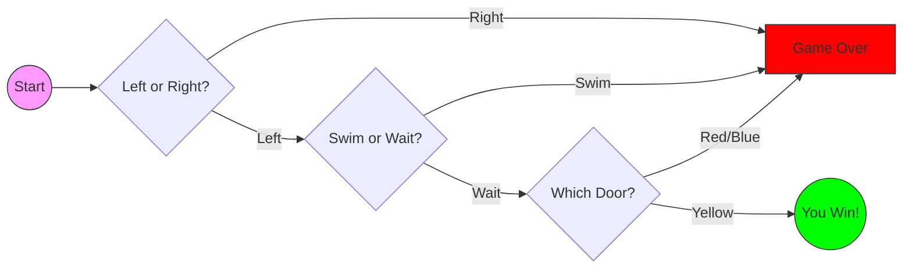

Task was to recreate [this game](https://viewer.diagrams.net/index.html?highlight=0000ff&edit=_blank&layers=1&nav=1&title=Treasure%20Island%20Conditional.drawio#Uhttps%3A%2F%2Fdrive.google.com%2Fuc%3Fid%3D1oDe4ehjWZipYRsVfeAx2HyB7LCQ8_Fvi%26export%3Ddownload#%7B%22pageId%22%3A%22C5RBs43oDa-KdzZeNtuy%22%7D).



I tried to keep the code as compact as possible.

```python
print(
    "You win!" if (
        L := lambda msg, choices: [
            c := input(msg).lower(), 
            c in choices
        ] and (c if c in choices else L(msg, choices))
    )(
        "Welcome to Treasure Island.\nLeft or right? ", ["left", "right"]
    ) == "left" 
    and L("Swim or wait? ", ["swim", "wait"]) == "wait" 
    and L("Which door? (Red, Blue, or Yellow) ", ["red", "blue", "yellow"]) == "yellow" 
    else "Game Over"
)
```

We used the walrus operator `:=` to name the lambda function within the expression. The function 
uses recursion to force valid user input; it will continue to prompt the user until their response 
matches one of the strings in the choices list. Because of Python's short-circuit evaluation, when a
wrong path is chosen, it jumps to `"Game Over"` immediately.